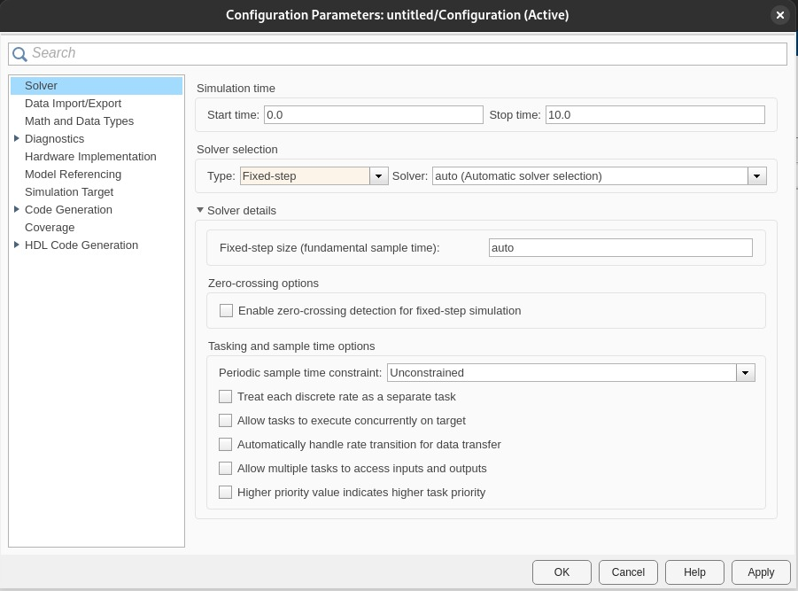
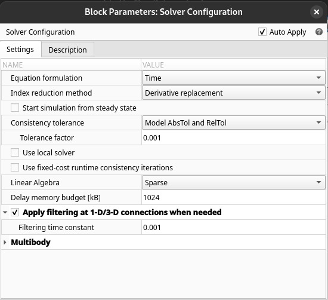
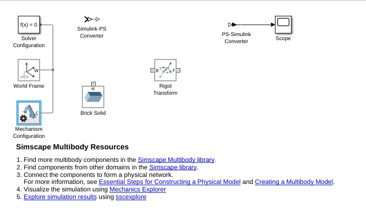
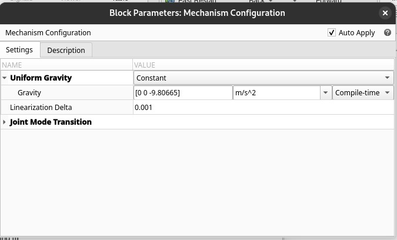

# Simscape Multibody

Simscape Multibody es una herramienta de Simulink utilizada para modelar sistemas mecánicos en 3D. Permite simular el comportamiento dinámico de mecanismos con articulaciones, cuerpos rígidos y fuerzas aplicadas. Su correcta configuración es esencial para obtener simulaciones precisas y eficientes.

## 1. Configuración del Solver  
El solver en Simscape Multibody define cómo se resuelven las ecuaciones diferenciales del sistema. La elección del solver depende de la rigidez del sistema y del nivel de precisión requerido.

### Diagrama del Proceso de Selección de Solver  
  
Figura 1. Diagrama que ilustra la elección entre solvers explícitos e implícitos.

## 2. Métodos de Integración  
🔑 *Método de Integración:* Técnica numérica utilizada por el solver para avanzar en el tiempo la solución del sistema dinámico.

Simscape Multibody permite elegir entre solvers explícitos e implícitos:

- **Solvers explícitos** (como *ode45*): Adecuados para sistemas simples y no rígidos.  
- **Solvers implícitos** (como *ode15s*): Útiles para sistemas rígidos o con contactos entre cuerpos.

💡**Ejemplo 1:** Comparación entre solvers  

| Solver   | Tipo       | Uso recomendado                        |
|----------|------------|----------------------------------------|
| `ode45`  | Explícito  | Sistemas simples y no rígidos          |
| `ode23t` | Implícito  | Sistemas de rigidez media              |
| `ode15s` | Implícito  | Sistemas rígidos o con contacto        |

## 3. Bloque de Configuración  

El **bloque de configuración de Simscape Multibody** establece los parámetros generales de simulación, como el solver utilizado y el tiempo de muestreo.

### 3.1. Parámetros del Bloque de Configuración  
- **Tipo de Solver**: Se recomienda usar *Variable-Step* para mayor precisión en sistemas dinámicos complejos.  
- **Paso de Integración**: Un paso más pequeño mejora la precisión, pero aumenta el costo computacional.

  
Figura 2. Bloque de configuración en Simscape Multibody mostrando opciones de solver y paso de integración.

## 4. Configuración de Mundo y Gravedad  

El entorno físico de la simulación se define mediante la configuración del mundo y la gravedad.

- **Sistema de Coordenadas Base:** Define la referencia global del modelo.  
- **Parámetro de Gravedad:** Permite establecer la aceleración gravitacional en m/s², con dirección y magnitud ajustables.

💡**Ejemplo 2:** Para simular condiciones en la Tierra, se configura la gravedad como:

$$ g = [0, 0, -9.81] \ m/s^2 $$

En Simscape Multibody, esto se ajusta dentro del bloque de configuración del mundo:

set_param('miModelo/WorldFrame', 'Gravity', '[0 0 -9.81]');

 //
 
💡**Figura 3**
 Diagrama que muestra la configuración del mundo y parámetros de gravedad en el entorno de simulación.

💡**Ejemplo 3**:
  
Figura 4. Modelo de un mecanismo en Simscape Multibody.

7. Ejercicios

📚 **Ejercicio 1**:
Configure un sistema de doble péndulo en Simscape Multibody.

Use diferentes solvers (ode45 y ode15s).
Analice el comportamiento en términos de estabilidad y tiempo de simulación.
Diagrama del Doble Péndulo:
 
Figura 5. Diagrama esquemático de un doble péndulo.

📚 **Ejercicio 2** :
Simule la caída libre de un objeto en diferentes entornos de gravedad:

Tierra: $ g = -9.81 \ m/s^2 $
Luna: $ g = -1.62 \ m/s^2 $
Marte: $ g = -3.71 \ m/s^2 $

Compare los tiempos de caída y la velocidad final.

## 8. Conclusiones

Simscape Multibody permite modelar y simular sistemas mecánicos de manera eficiente. La correcta selección del solver y la configuración de mundo y gravedad son fundamentales para obtener simulaciones precisas y estables. El uso de bloques de configuración y scripts en MATLAB facilita la personalización de la simulación según los requerimientos del sistema.

## 9. Referencias

MathWorks. Simscape Multibody Documentation.
Craig, J. J. Introduction to Robotics: Mechanics and Control.
García, J. (2021). Modelado de Sistemas Mecánicos con Simulink.
